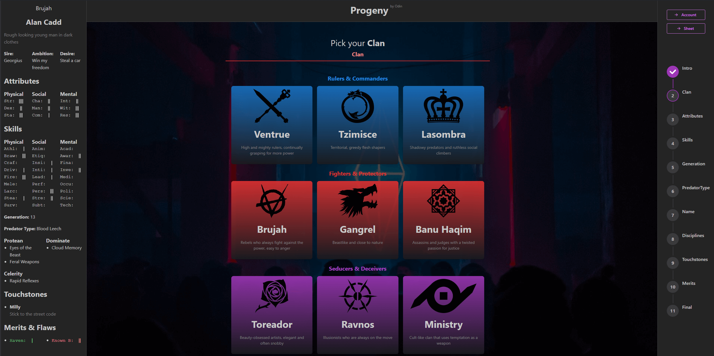
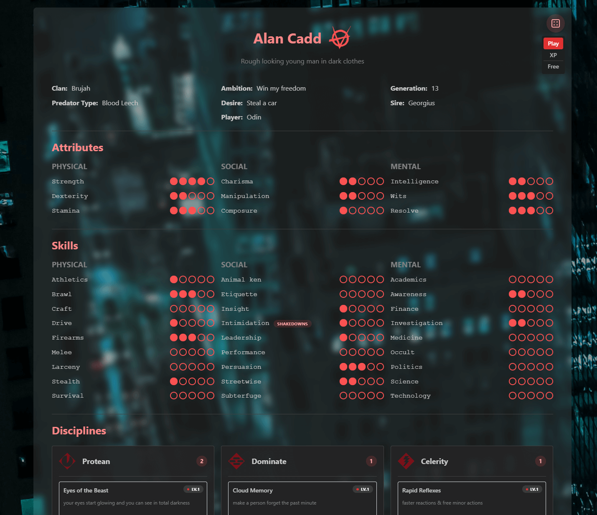
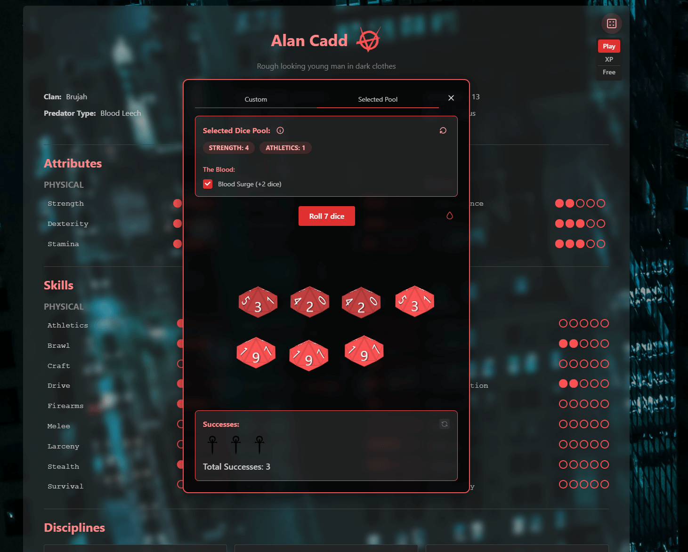

[Github repository](https://github.com/Odin94/Vampire-v5-character-generator)

Give it a whirl here: [https://progeny.odin-matthias.de](https://progeny.odin-matthias.de)

Progeny is a character creator & character sheet & dice roller for Vampire: The Masquerade V5.

## Why I built it

I originally built Progeny because I was dissatisfied with how complicated building a character for this game is, and I've played it with a lot of newcomers that had to get over that wall. Part of that complexity comes from the infamously bad layout of the core rule book, but much of it is rooted in VtM being one of *those* games. 

Games that looked at the absurd complexity of D&D and thought "this is how TTRPGs are supposed to work", and now you have to study rules for 5h before you can play. This is bad and unnecessary.

For this reason my main goal with Progeny is to build a streamlined and simple way to create a character, rather than offer a detailed and complex setup that allows for every nuance. In my humble opinion, I succeeded in that, and had only minor trade-offs. Also, now that progeny has a character sheet that allows free editing, experts can craft their own characters as they desire.

## Cool Features

While Progeny started out as a mere character creation tool, it has now become a fully featured play companion. You can:

* Create characters
* Export them to Foundry VTT
* Or use them in the progeny character sheet
* Connect to other players via a chat session
* Share your characters with other players (read only)
* Roll dice 🎲
* ... based on attributes/skills/disciplines
* ... optionally adding blood surge, specific discipline powers, specialties
* ... one-click roll rouse checks (auto-updates hunger)
* ... one-click roll remorse (auto-updates humanity)
* Automatically share all your dice rolls with other players in a chat session

## The boring part
Which tech I used and why.

*Programming language:* All of my stuff is in typescript, I like the types, I like the script. It's objectively better than your favorite language (unless that's Elixir)

*Libraries and Frameworks:* React because that's what I know, Mantine because that's what somebody on youtube recommended when I got started (nowadays I'd use tailwind & shadcn, but mantine is still cool), fastify backend because that's modern and not nestjs (nestjs is bad for all the reasons java is bad, don't @ me), SQLite because it's simple to use and easy to back up.

*Hosting:* Hetzner for hosting the backend because it's cheap, Netlify for hosting the frontend because it's free.